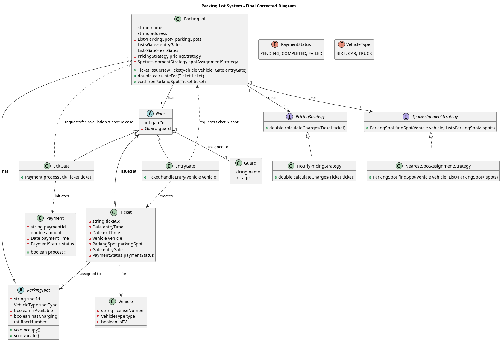

# Parking Lot Design

## Requirements
- Multiple types of parking spots for different vehicle types (e.g., car, bike, truck).
- Support for multiple floors.
- Some parking spots have additional features like charging for electric vehicles (EVs).
- Extra features (e.g., charging) incur additional costs.
- Ground floor has multiple entry and exit gates.
- Each gate has a human guard who issues tickets to customers.
- Parking spots are allocated using the "closest available spot" strategy.
- Entry is denied if no parking spots are available.

The design should:
- Follow SOLID principles.
- Apply useful design patterns.


```
@startuml
title Parking Lot System - Final Corrected Diagram


class ParkingLot {
    - string name
    - string address
    - List<ParkingSpot> parkingSpots
    - List<Gate> entryGates
    - List<Gate> exitGates
    - PricingStrategy pricingStrategy
    - SpotAssignmentStrategy spotAssignmentStrategy
    + Ticket issueNewTicket(Vehicle vehicle, Gate entryGate)
    + double calculateFee(Ticket ticket)
    + void freeParkingSpot(Ticket ticket)
}

' Gates are interfaces and depend on the ParkingLot for logic.
abstract class Gate {
    - int gateId
    - Guard guard
}
class EntryGate extends Gate {
    + Ticket handleEntry(Vehicle vehicle)
}
class ExitGate extends Gate {
    + Payment processExit(Ticket ticket)
}

' The Guard is a person who operates the Gate.
class Guard {
    - string name
    - int age
}

' Vehicle and Ticket are core data models.
class Vehicle {
    - string licenseNumber
    - VehicleType type
    - boolean isEV
}
class Ticket {
    - string ticketId
    - Date entryTime
    - Date exitTime
    - Vehicle vehicle
    - ParkingSpot parkingSpot
    - Gate entryGate
    - PaymentStatus paymentStatus
}


abstract class ParkingSpot {
    - string spotId
    - VehicleType spotType
    - boolean isAvailable
    - boolean hasCharging
    - int floorNumber
    + void occupy()
    + void vacate()
}


class Payment {
    - string paymentId
    - double amount
    - Date paymentTime
    - PaymentStatus status
    + boolean process()
}
enum PaymentStatus {
    PENDING, COMPLETED, FAILED
}
enum VehicleType {
    BIKE, CAR, TRUCK
}

' --- Strategies ---
interface PricingStrategy {
    + double calculateCharges(Ticket ticket)
}
class HourlyPricingStrategy implements PricingStrategy {
    + double calculateCharges(Ticket ticket)
}
interface SpotAssignmentStrategy {
    + ParkingSpot findSpot(Vehicle vehicle, List<ParkingSpot> spots)
}
class NearestSpotAssignmentStrategy implements SpotAssignmentStrategy {
    + ParkingSpot findSpot(Vehicle vehicle, List<ParkingSpot> spots)
}


' --- Relationships (Corrected) ---

' CORRECTED: ParkingLot HAS parts, but doesn't OWN their existence -> Aggregation (o--)
ParkingLot "1" o-- "*" ParkingSpot : has
ParkingLot "1" o-- "*" Gate : has

' CORRECTED: ParkingLot USES strategies -> Association (-->)
ParkingLot "1" --> "1" PricingStrategy : uses
ParkingLot "1" --> "1" SpotAssignmentStrategy : uses

' A Gate has a Guard assigned to it.
Gate "1" o-- "1" Guard : assigned to

' CORRECTED: Ticket is associated with independent objects -> Association (-->)
Ticket "1" --> "1" Vehicle : for
Ticket "1" --> "1" ParkingSpot : assigned to
Ticket "1" --> "1" Gate : issued at

' CORRECTED: Gates DEPEND on ParkingLot for core logic -> Dependency (..>)
EntryGate ..> ParkingLot : requests ticket & spot
ExitGate ..> ParkingLot : requests fee calculation & spot release

' CORRECTED: Gates CREATE Tickets/Payments, they don't own them -> Dependency (..>)
EntryGate ..> Ticket : creates
ExitGate ..> Payment : initiates

@enduml
```


---
